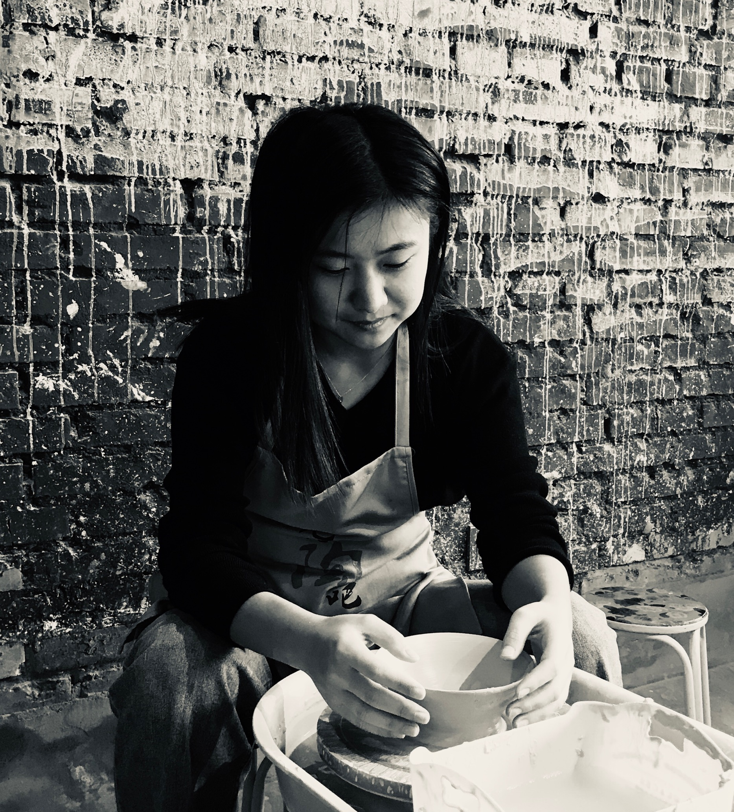

## Yuanyuan Zhao

Hi! My name is Yuanyuan Zhao and I am studying for my master degree of Data Science (Computer Science and Technology) in Academy for Advanced Interdisciplinary Studies, Peking University.

I have been a research assistant in the Language Computing and Web Mining Group since 2017, supervised by [Dr. Weiwei Sun](https://www.cl.cam.ac.uk/~ws390/) and [Prof. Xiaojun Wan](https://wanxiaojun.github.io/).

My research focuses on deep representations for natural language (especially [Interlanguage](https://en.wikipedia.org/wiki/Interlanguage)) and their applications in [Computer Assisted Language Learning (CALL)](https://en.wikipedia.org/wiki/Computer-assisted_language_learning).

~~I am looking for an institute to continue my research as a phd candidate in 2021.
If you have any advise, please contact me (zhao_yy at pku.edu.cn)!~~

I am going to join [Shandong Provincial Education Department](http://edu.shandong.gov.cn/) in 2021.

See you in Jinan!

### Education

- BE of Telecommunication Engineering in Beijing University of Posts and Telecommunications (BUPT)

### Publication

1. [Semantic Parsing for English as a Second Language](https://www.aclweb.org/anthology/2020.acl-main.606.pdf)
(**Yuanyuan Zhao**, Weiwei Sun, Junjie Cao and Xiaojun Wan), ACL 2020 (Long Paper)
2. [Semantic Role Labeling for Learner Chinese: the Importance of Syntactic Parsing and L2-L1 Parallel Data](https://aclweb.org/anthology/D18-1414) (Zi Lin, Yuguang Duan, **Yuanyuan Zhao**, Weiwei Sun and Xiaojun Wan), EMNLP 2018 (Long Paper)
3. [Overview of the NLPCC 2018 Shared Task: Grammatical Error Correction](http://tcci.ccf.org.cn/conference/2018/papers/EV11.pdf) (**Yuanyuan Zhao**, Nan Jiang, Weiwei Sun and Xiaojun Wan), NLPCC 2018
4. [Pre- and In-Parsing Models for Neural Empty Category Detection](https://aclweb.org/anthology/P18-1250) (Yufei Chen, **Yuanyuan Zhao**, Weiwei Sun and Xiaojun Wan), ACL 2018 (Long Paper)

### Others
1. [Constructing a Family Tree of Ten Indo-European Languages with Delexicalized Cross-linguistic Transfer Patterns](https://arxiv.org/abs/2007.09076) (**Yuanyuan Zhao**, Weiwei Sun and Xiaojun Wan), arXiv:2007.09076
